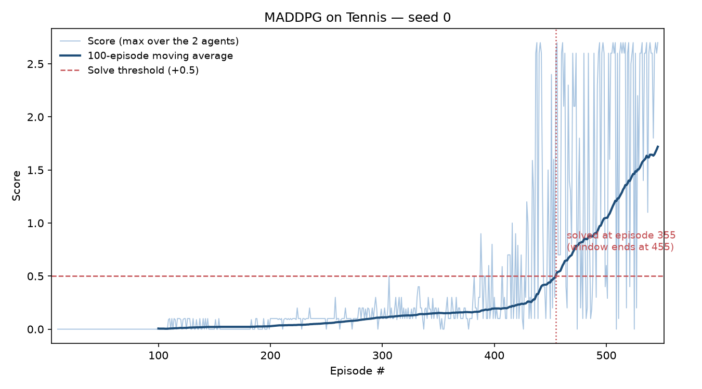
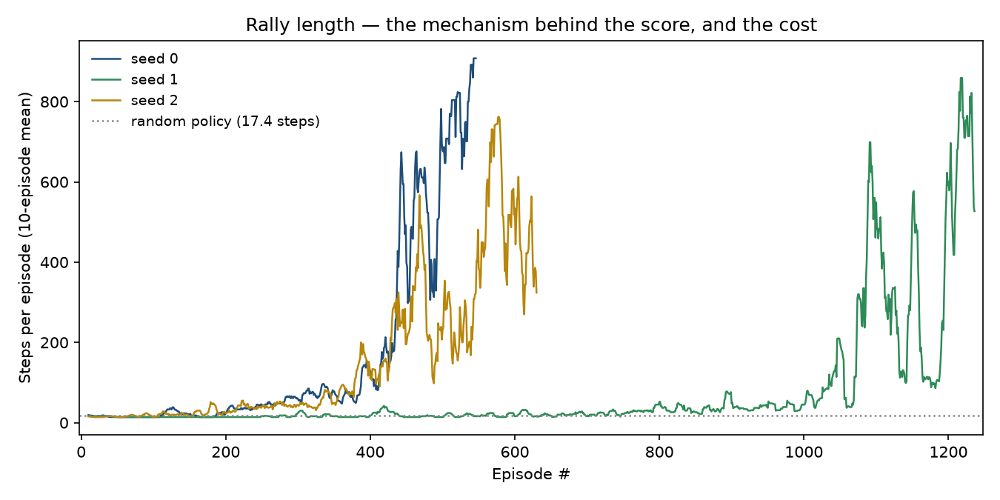

# Collaboration and Competition — Unity Tennis

Two agents controlling rackets, learning to keep a rally going, trained with
**MADDPG** — a shared policy with a centralised critic.

This is project 3 of the Udacity Deep Reinforcement Learning Nanodegree. The
code runs on **Python 3.11 and PyTorch 2.x** — not the Python 3.6 / TensorFlow
1.7 stack the original course materials assume — via a modernised copy of the
Unity ML-Agents v0.4 client vendored in [`vendor/`](vendor). See
[`docs/PORTING.md`](docs/PORTING.md) for what that took.

---

## The environment

Two rackets play a ball over a net. An agent scores **+0.1 each time it hits the
ball over**, and **−0.01** if it lets the ball hit the ground or sends it out of
bounds. So the reward structure rewards *rallies*, not winning points — the two
agents do best by keeping the ball in play together, which is what makes this a
collaboration task despite looking like a competitive one.

| | |
|---|---|
| **Observation space** | 24 continuous values per agent — 3 stacked frames of 8 variables (position and velocity of ball and racket) |
| **Action space** | 2 continuous values per agent — movement toward/away from the net, and jumping |
| **Action range** | every entry must lie in `[-1, 1]` |
| **Agents** | 2, each with its own observation and its own reward |
| **Episode length** | variable — the episode ends when the ball is not returned |

**A random policy scores 0.0154**, with only 7 of 50 episodes scoring above zero
at all. That is the floor these results should be read against.

### When it is solved

Scoring takes two steps, and the second one is easy to get wrong:

1. After each episode, sum each agent's rewards *without* discounting. That
   gives 2 scores.
2. Take the **maximum** of those two — not the mean. This is the episode's
   score.

The environment is **solved when the average of those episode scores over 100
consecutive episodes reaches +0.5**.

Using the mean instead of the maximum would roughly halve every score, and a
perfectly good agent would never register as solved. The rule is explicit in
`config.py` as `score_reduce`, recorded in every result file, and asserted in
the tests.

As with the previous project, the *reported* solve episode follows the course's
convention — the episode before the qualifying 100-episode window — and every
result file also records `episodes_run`, the raw count actually executed, which
is 100 higher.

---

## Getting started

### 1. Clone and install

```bash
git clone https://github.com/tropibyte/deep-rl-tennis-collab-compete.git
cd deep-rl-tennis-collab-compete
python -m venv .venv
```

```bash
.venv/Scripts/python -m pip install -e ".[dev]"
```

On macOS or Linux the second command is `.venv/bin/python -m pip install -e ".[dev]"`.

Python 3.10 or newer. No GPU required — everything here was developed and
measured on a 4-core CPU laptop.

**`protobuf` is pinned to 3.20.3 and this matters.** The vendored ML-Agents
protobuf stubs were generated by protoc 3.5 and use a descriptor API that the
protobuf 4.x runtime rejects outright. Upgrade it and nothing will connect.

### 2. Download the Unity environment

You do **not** need to install Unity. Download the build for your platform and
unzip it into the repository root:

- [Linux](https://s3-us-west-1.amazonaws.com/udacity-drlnd/P3/Tennis/Tennis_Linux.zip)
- [macOS](https://s3-us-west-1.amazonaws.com/udacity-drlnd/P3/Tennis/Tennis.app.zip)
- [Windows 64-bit](https://s3-us-west-1.amazonaws.com/udacity-drlnd/P3/Tennis/Tennis_Windows_x86_64.zip)
- [Windows 32-bit](https://s3-us-west-1.amazonaws.com/udacity-drlnd/P3/Tennis/Tennis_Windows_x86.zip)
- [Linux headless](https://s3-us-west-1.amazonaws.com/udacity-drlnd/P3/Tennis/Tennis_Linux_NoVis.zip) (for training on a server)

On Windows, `unzip` is not a PowerShell command — use `Expand-Archive`, or
extract through Explorer. Afterwards the repository root should contain
`Tennis_Windows_x86_64/Tennis.exe` (or the equivalent for your platform). To
keep the build elsewhere, set `TENNIS_ENV_PATH` or pass `--exe`.

### 3. Check the installation

```bash
.venv/Scripts/python -m pytest
```

Forty unit tests covering the replay buffers, n-step returns, noise processes,
networks, the agent-centric joint views and the scoring rule. None of them needs
the Unity build. To confirm the environment itself is wired up:

```bash
.venv/Scripts/python scripts/random_baseline.py --episodes 50
```

That prints the observation and action sizes, checks them against what the agent
assumes, and asserts the reward channel is live — worth doing, because on a
reward this sparse a broken channel and a working one both look like "mostly
zeros".

---

## Running the code

### Train

```bash
.venv/Scripts/python -m tennis.cli train --config configs/maddpg.yaml
```

Writes the full history to `results/<tag>.json` and three checkpoints to
`checkpoints/`: `_solved.pt` (weights at the moment the criterion was met),
`_best.pt` (highest 100-episode average) and `_final.pt`.

Useful flags: `--seed`, `--episodes`, `--tag`, `--graphics` to watch the rally,
and `--torch-threads` to bound CPU use when running several trainings at once.

### Watch a trained agent

```bash
.venv/Scripts/python -m tennis.cli eval checkpoints/maddpg_seed0_solved.pt --graphics --episodes 3
```

Exploration noise is off by default, which is how the policy would actually be
deployed.

### A note on timing

Tennis gets **more expensive as it succeeds**. A random episode lasts about 17
steps; a competent agent sustains rallies of several hundred. Early throughput
therefore badly underestimates the cost of the later episodes — in these runs
the per-episode time more than doubled between episode 400 and episode 1000,
purely because the rallies got longer. Budget accordingly, and do not
extrapolate a total from the first few minutes.

---

## Repository layout

```
src/tennis/
  agent.py       MADDPG: shared actor, centralised critic, agent-centric views
  networks.py    Actor, Critic, TwinCritic
  replay.py      uniform and prioritised replay, n-step accumulation
  noise.py       Ornstein-Uhlenbeck and Gaussian exploration
  train.py       training loop, max-scoring, solve detection, evaluation
  env.py         vectorised wrapper around the Unity environment
  config.py      every hyperparameter, loadable from YAML
  plotting.py    the figures in the report
  record.py      screen-capture recorder for the trained agent
configs/         one YAML per arm
scripts/         random_baseline, bench_env, run_study, analyze,
                 diagnose, salvage, make_configs
vendor/          modernised ML-Agents v0.4 client
tests/           unit tests
```

Most of this is inherited from the
[Reacher project](https://github.com/tropibyte/deep-rl-reacher-continuous-control);
what is new here is the multi-agent handling in `agent.py` and the scoring rule
in `train.py`.

## Results

**Solved in 355 episodes**, on all three seeds (355, 365, 998). The saved policy
scores **2.12 ± 1.01** over five evaluation episodes with exploration off —
against a random-policy floor of 0.0154 and a target of +0.5.



Rally length is the mechanism: the reward pays for keeping the ball in play, so
the score and the rally are the same fact seen twice. A random policy sustains
17.4 steps; the trained agents sustain over 900.



That is also why the task gets *more expensive as it succeeds* — 0.14 s per
episode early, 24.4 s after solving, a 170-fold increase.

See **[Report.md](Report.md)** for the learning algorithm, hyperparameters,
network architectures, the plot of rewards, the number of episodes needed to
solve, and ideas for future work.

## Licence

MIT — see [LICENSE](LICENSE).
