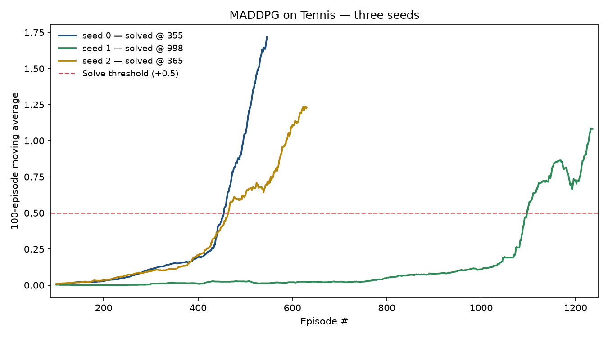

# Report — Collaboration and Competition with MADDPG

Solving the Unity Tennis environment: two agents controlling rackets, rewarded
+0.1 for each ball sent over the net and −0.01 for letting it drop, so the pair
does best by sustaining a rally together.

---

## 1. The learning algorithm

### Why this is not just Reacher with fewer agents

The previous project's 20 arms never interacted. Each one's environment was
stationary, so a critic that saw one arm's state could account for everything
that happened to it, and 20 arms were simply 20 decorrelated samplers of one
policy.

Tennis breaks that. Each racket's observations depend on what the other racket
did, so from either agent's point of view **the environment changes as the other
agent learns**. A critic seeing only its own agent is regressing on a moving
target whose cause is invisible to it, and the same state-action pair genuinely
has different values at different points in training. That non-stationarity is
the standard reason independent DDPG is unstable on multi-agent tasks.

### MADDPG: centralised training, decentralised execution

**MADDPG** (Lowe et al., 2017) resolves this by giving the *critic* more
information than the *actor*:

- The **critic** sees both agents' observations and both agents' actions — 48
  observation values and 4 action values. The transition it is asked to explain
  is then fully determined by its inputs, and the non-stationarity disappears
  from its point of view.
- The **actor** sees only its own 24 observations. So the learned policy is
  still runnable by one racket that knows nothing about the other, which is what
  makes the extra information a *training-time* device rather than a cheat.

### One policy for both rackets

The two rackets face a symmetric task, so a single actor drives both. That is
self-play: every episode yields two trajectories for the same policy, and the
opponent improves exactly as fast as the agent does.

Sharing a critic between two agents needs more care than sharing an actor. Fed
the joint state in a fixed ordering, the critic would see one input mapping to
two different rewards — agent 0's and agent 1's — and could fit neither. So
every transition is stored **twice, once from each agent's point of view**, with
that agent's own observation leading:

```
agent 0's row:  state = [obs0, obs1]   action = [a0, a1]   reward = r0
agent 1's row:  state = [obs1, obs0]   action = [a1, a0]   reward = r1
```

The critic then always answers a well-posed question — "what is this
state-action worth *to the agent whose observation comes first*" — and both
agents' experience trains the same weights.

The actor update follows MADDPG: only the acting agent's action is replaced by
the policy's current output, while the other racket's action stays as it was
actually played. Differentiating through both would credit this policy for the
opponent's choice.

Three properties of that scheme are asserted in `tests/test_multiagent.py` — the
ordering, that row *i* carries agent *i*'s reward, and that the reordering is a
permutation rather than a copy. All three would fail as *slow learning* rather
than as an error, which is the class of bug that cost two and a half hours on
the previous project.

### What was inherited rather than rediscovered

The replay buffers, n-step accumulation, noise processes, networks and the
modernised ML-Agents v0.4 client are carried over from the Reacher project
unchanged, along with two findings that were expensive to obtain there:

- **Layer normalisation on both hidden layers.** Raw Unity observations are not
  scaled for a network, and without normalisation that project's actor drove its
  `tanh` into saturation — 66.5% of actions pinned at the limit, one output dead
  at a constant −1.0 — and two seeds in three never left the random baseline.
- **A standard-normal Ornstein–Uhlenbeck innovation.** The reference DRLND
  implementation draws from `random.random()`, a strictly positive uniform,
  which gives the noise a non-zero mean and biases every action in one direction.

---

## 2. Model architectures

**Actor** — `24 → 256 → 128 → 2`, ReLU on the hidden layers with layer
normalisation, `tanh` on the output to bound both action values to `[-1, 1]`.

**Critic** — `48 → 256`, then the 4 joint action values are **concatenated** and
the result passes `260 → 128 → 1`, ReLU throughout with layer normalisation and a
linear output because a Q-value is unbounded.

The critic's input width is the only thing centralisation changes; with
`centralised_critic: false` it becomes `24 → 256` and `258 → 128 → 1`.

Actions enter at the second layer following the DDPG paper, so the first layer
learns a representation of the joint state alone. Hidden layers initialise
uniformly from `±1/sqrt(fan_in)`; final layers from `±3e-3`, so the policy starts
near the centre of the action range and the critic near zero.

---

## 3. Hyperparameters

| Parameter | Value | Why |
|---|---|---|
| Replay buffer | 1,000,000 | |
| Batch size | 256 | Larger than Reacher's 128: only 2 transitions arrive per step, against 20 |
| Discount `gamma` | 0.99 | |
| Soft update `tau` | 0.01 | 10x Reacher's. Both agents' targets must track a policy that is also its own opponent; slower tracking leaves the critic chasing a stale adversary |
| Actor learning rate | 1e-4 | |
| Critic learning rate | 1e-3 | |
| Weight decay | 0 | |
| Update cadence | 1 update / 1 step | Tennis episodes are short early on, so a batched schedule would learn almost nothing during the phase that matters most |
| Warm-up | 1,024 transitions | ~30 episodes at the initial rally length |
| Normalisation | layer, both hidden layers | Inherited from Reacher, where it decided whether the task solved at all |
| Critic gradient clip | 1.0 | |
| Exploration | Ornstein–Uhlenbeck, `sigma` 0.2 → 0.01 | |
| Noise decay | 0.999 per episode | The reward is sparse until an agent can return the ball, so exploration must persist far longer than in Reacher — but must eventually stop interrupting the rallies the score pays for |
| Episodes | 2,500 budget | Runs were stopped at 546–1,236; see section 5 |
| Score reduction | **max** over the 2 agents | The project's rule. The mean would halve every score and nothing would register as solved |

---

## 4. Results

### Solved on all three seeds

| Seed | Solved at episode | Raw episodes run | Best 100-episode average |
|---|---|---|---|
| **0** | **355** | 455 | 1.719 |
| 2 | 365 | 465 | 1.236 |
| 1 | 998 | 1,098 | 1.086 |

**Median: 365 episodes.** Against a random-policy floor of **0.0154** — where
only 7 of 50 episodes scored above zero at all — and a target of +0.5.

The saved policy scores **2.12 ± 1.01** over five evaluation episodes with
exploration switched off (min 0.10, max 2.70), more than four times the
threshold.


As in the previous project, two numbers describe the same run: the solve episode
is reported under the course's convention (the episode before the qualifying
100-episode window), and `episodes_run` in every result file records the raw
count, 100 higher.

### All three seeds



Seeds 0 and 2 tracked each other almost exactly — 355 and 365 — while seed 1
took nearly three times as long at 998. Its flat period was slow learning rather
than a dead run, which is only knowable in hindsight: at episode 950 it sat at
0.095 while the others were already above 0.25, and stopping it there would have
recorded a failure that did not exist.

Three seeds is the minimum this project trusts, for reasons the Reacher study
made concrete: effects that looked decisive on one seed repeatedly vanished when
measured on three.

### Rally length is the mechanism


The reward pays for keeping the ball in play, so the score and the rally length
are the same fact seen twice. A random policy sustains **17.4 steps**; by the end
seed 0 was sustaining **over 900**, approaching the 1,000-step cap.

This also explains the cost profile, which is the opposite of Reacher's. A
Reacher episode always cost 1,001 steps. A Tennis episode costs whatever the
agents can sustain, so **the task gets more expensive precisely as it succeeds**:

| Phase | Rally length | Cost per episode |
|---|---|---|
| Random / early training | ~17 steps | 0.14 s |
| Around the solve | ~150 steps | 1.4 s |
| After the solve | ~900 steps | **24.4 s** |

A 170-fold increase. Any throughput estimate taken in the first minutes of a
Tennis run is not merely imprecise — it is measuring a different regime from the
one that will dominate the budget.

### Why the runs were stopped early

All three runs were stopped between episodes 546 and 1,236, short of the 2,500
budget. At that point every seed had solved, all were scoring two to three times
the threshold, and rallies were approaching the step cap — so episodes were
increasingly being *truncated* rather than ending naturally. Completing the
budget was projected at **13+ hours** and would have bought confirmation only.

The records are reconstructed from the run logs and marked `truncated: true`.
One artefact of that is worth stating plainly: the training loop originally
logged only every tenth episode until the 100-episode window filled, so the
first 100 episodes of each curve are sampled rather than complete. Every episode
from 100 onwards — including all of the solve criterion — is exact. The loop now
logs every episode, so a future early stop loses nothing.

---

## 5. Ideas for future work

**Measure whether the centralised critic earned its complexity.** This is the
project's headline design decision and it is currently *unmeasured*: the baseline
solved on the first configuration tried, so `centralised_critic: false` was never
run. That arm is already implemented behind a config flag and is the single most
valuable next experiment — the Reacher study found that two of the interventions
its own source material described as critical made no measurable difference, and
gradient clipping there turned out to be provably inert. The honest position is
that MADDPG worked here, not that the centralisation is why.

**Carry over the two interventions that did work on Reacher.** Prioritised
replay solved 3/3 seeds there with a median of 36 episodes against the
baseline's 141, and 5-step returns gave the highest ceiling. Both are already
implemented here and both suit this task's sparse early reward, where most
transitions carry no signal at all. `maddpg_per` and `maddpg_nstep` are one
config each.

**Attack the variance, since it is the remaining weakness.** Seed 1 took 2.7x
longer than seeds 0 and 2 with identical code and hyperparameters. Nothing tested
here reduces that spread. Self-play offers a specific lever the single-agent
setting did not: maintaining a pool of past opponents rather than always playing
the current policy, which is the standard defence against the two agents
co-adapting into a narrow, brittle equilibrium.

**Give the episode cap some thought.** Rallies reached 900+ steps against a
1,000-step limit, so the best agents were being cut off mid-rally. That
truncation is invisible in the score but means the final policies were never
evaluated on what they could actually sustain. Raising the cap would cost
proportionally more compute per episode — which, on this task, is the price of
success.

**Test the noise decay.** `sigma` decays at 0.999 per episode, chosen by
reasoning about sparse reward rather than measured. Given that exploration noise
actively interrupts the long rallies the score rewards, the decay schedule is a
plausible lever on both the solve episode and the seed variance, and
`maddpg_nonoisedecay` would isolate it.

---

## Appendix: reproducibility and cost

All results were produced on a 4-core Intel i7-8550U laptop with **no GPU**,
running three seeds concurrently at one torch thread each.

| Measure | Value |
|---|---|
| Random-policy score | 0.0154 (7 of 50 episodes above zero) |
| Random episode length | 17.4 steps (14–69) |
| Observation / action | 24 and 2 per agent, 2 agents |
| Time to first solve | ~20 minutes (seed 0, 455 episodes) |
| Cost per episode | 0.14 s early, 24.4 s after solving |

Every hyperparameter lives in `config.py` and is written to
`results/<tag>.config.yaml` beside each run's scores, including defaults never
mentioned in the YAML, so any curve here can be traced to the settings that
produced it.
